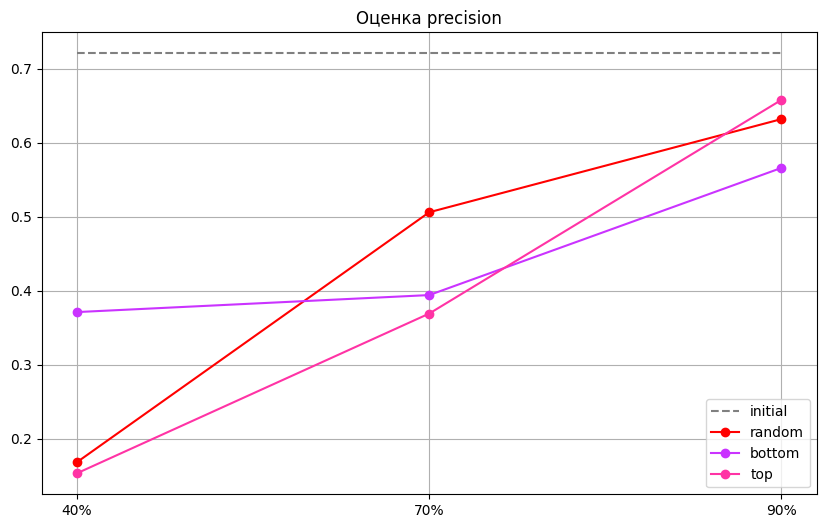
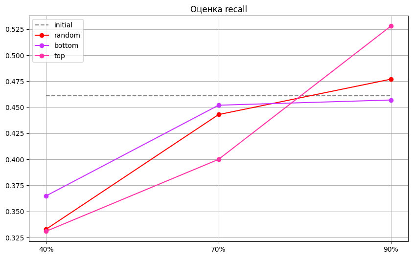
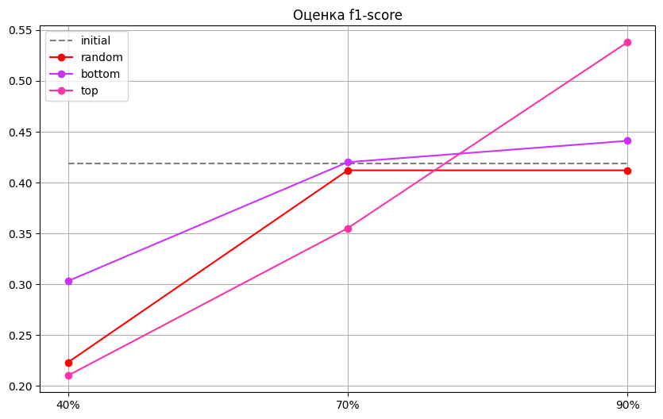
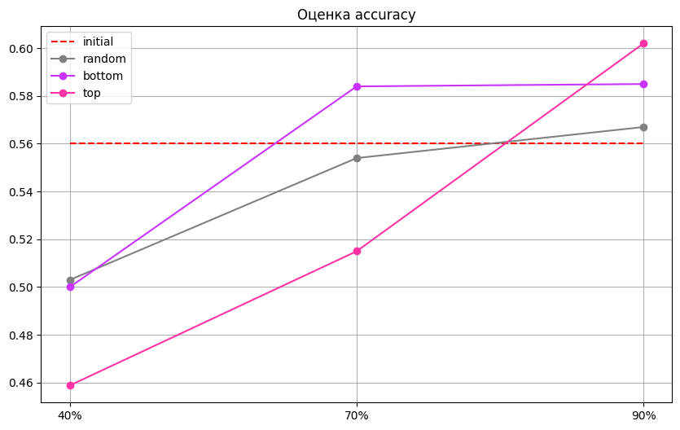

# Data-pruning-on-Russian-data
## Предыдущие работы
Данные для обучения языковых моделей, как правило, собираются с помощью краулинга интернет-сайтов, поскольку это не требует больших ресурсов. Это приводит к тому, что зачастую в итоговый датасет попадают некачественные “зашумленные” тексты –  неграмотно написанные, содержащие большое количество повторов или сокращений – которые снижают качество полученной модели. Традиционно для очистки датасета используются устанавливаемые вручную фильтры, однако в последние годы популярность набирают автоматические подходы к **обрезке данных (data-pruning)**. Так, статья [When Less is More](https://arxiv.org/pdf/2309.04564.pdf) посвящена поиску оптимальной метрики, которая могла бы решить эту проблему. В центре внимания оказываются три метода обрезки данных, основанные на разных метриках (**data pruning methods**): perplexity, Error L2-Norm и Memorization factor. Сначала авторы обучают авторерегрессивную decoder-only модель с GPT архитектурой на английском датасете CommonCrawl 2022-го года, чтобы затем использовать ее для вычисления необходимых метрик. С помощью приведенных выше методов датасет фильтруется, и остается лишь часть данных -- 10%, 30%, 50% и 70% интервалы с начала и с конца выборки. Затем на уменьшенном датасете обучают другие модели, а для понимания эффективности метрик данные также обрезаются рандомно. Затем тот же процесс проводится для моделей, предобученных на определенную задачу (SST, MRPC, QQP, QNLI, RTE & WNLI). В результате после огромного количества экспериментов выясняется, что лучше всех себя проявляет самая простая метрика - perplexity, которая в среднем показывает результаты лучше на 1.5%.

## Наше исследование
Поскольку метод фильтрации данных, основанный на метрике perplexity, показал наилучший результат на данных английского языка, в этой работе мы хотели проверить эффективность метода пруннинга, основанного на этой метрике на данных русского языка, поскольку подобного исследования не проводилось. Помимо этого, мы решили провести эксперимент не только с декодер моделью, но и с энкодер, для этого мы:
1) использовали результаты обучения модели BERT, дообученной для задачи определения тональности текста;
2) использовали результаты обучения модели с GPT-архитектурой для генерации текста.

Мы поставили следующие  **гипотезы**:
1) метод пруннинга, основанный на перплексии, для русских данных покажет результаты примерно такие же результаты как в английском;
2) модели, обученные на текстах с высокой перплексией, будут работать лучше (было главной гипотезой опорной статьи)

## Перплексия
Perplexity –  это мера отклонения сгенерированного текста от настоящего. 
$\text{Perplexity} = \exp\left(-\frac{1}{N} \sum \log_2(p(w_i))\right)$, где  N - общее количество слов в тексте, p(w_i) - вероятность появления слова w_i в модели.

В контексте языковых моделей перплексия оценивает, насколько хорошо модель предсказывает текст, и часто используется для оценки качества моделей в задачах NLP.
Меньшее значение перплексии указывает на то, что модель лучше предсказывает выборку, т.е. модель более уверена в своих предсказаниях. На практике это означает, что модель с низкой перплексией более точно предсказывает следующие слова в тексте.

## Схема эксперимента
1) дообучить модель на русском датасете;
2) посчитать с помощью дообученной модели перплексию для каждого текста в датасете;
3) "обрезать" датасет;
4) дообучить модель на новых данных;
5) провести сравнение с первоначальной моделью.

## Методы
* Обучение берта на задачу сентимент анализа: [модель](https://huggingface.co/cointegrated/rubert-tiny), [датасет](https://www.kaggle.com/competitions/sentiment-analysis-in-russian/overview)  
Файнтюним предобученную модель для задачи классификации, затем пруним данные 9-ю способами: берём 40%,70% и 90% снизу, затем их же сверху; также пруним рандомно: убираем 40%, 70% и 90% датасета. Всего ообучаем 10 моделей;
* Обучение gpt: [модель](https://huggingface.co/ai-forever/rugpt3small_based_on_gpt2), [датасет](https://github.com/TatianaShavrina/taiga_site/blob/master/corpus/nplus1.md)  
Файнтюним предобученную на русском gpt2 на скачанных данных новостных сми, затем фильтруем 2-мя способами: считая перплексию и рандомно, на 7 интервалах, отсекаем только верхнюю часть датасета без деления на bottom/top.
## Результаты
Оценка модели, обученной для задачи SST, по 4 основным метрикам:

 
 

Обучая изначально на маленьком датасете из 150-ти файлов ошибка была около 8. После первого обучения gpt на полном датасете перплексия на валидационной выборке стала 2.6, после урезания 30% выборки стала 3.5. Это не говорит в пользу теории, однако для русского языка это нормальный результат, так как в русском гораздо больше морфологии, чем в английском. Далее на графике представлены результаты очистки по перплексии и случайным образом от 10% до 90%:

